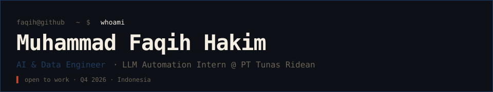
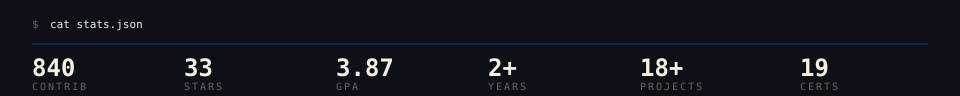
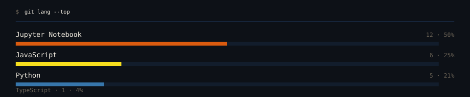

<a href="https://faqihhakim.tech/"><code>$ open faqihhakim.tech                    # portfolio</code></a><br>
<a href="https://www.linkedin.com/in/faqih-hakim/"><code>$ open linkedin.com/in/faqih-hakim        # network</code></a><br>
<a href="mailto:mhmdfkih21@gmail.com"><code>$ mail mhmdfkih21@gmail.com               # inbox</code></a><br>
<a href="https://huggingface.co/faqihhakim"><code>$ open huggingface.co/faqihhakim         # models</code></a>

```text
// stack
LLM · Python · PyTorch · LangChain · Hugging Face
data · SQL · Pandas · Airflow · vector DB · RAG
graph · Neo4j · NetworkX
```



