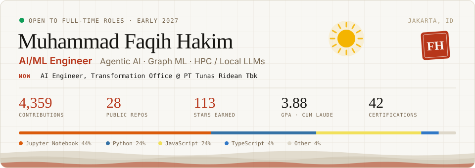
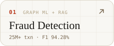
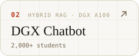
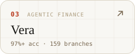
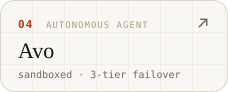

<a href="https://faqihhakim.tech/"><picture><source media="(prefers-color-scheme: dark)" srcset="./svg/profile-dark.svg"></picture></a>

    

<a href="https://faqihhakim.tech/projects/graph-fraud-detection/"><picture><source media="(prefers-color-scheme: dark)" srcset="./svg/project-fraud-dark.svg"></picture></a> <a href="https://faqihhakim.tech/projects/dgx-chatbot-agentic-rag/"><picture><source media="(prefers-color-scheme: dark)" srcset="./svg/project-dgx-dark.svg"></picture></a> <a href="https://faqihhakim.tech/projects/ai-financial-reconciliation-agent/"><picture><source media="(prefers-color-scheme: dark)" srcset="./svg/project-vera-dark.svg"></picture></a> <a href="https://github.com/Fqih/avo"><picture><source media="(prefers-color-scheme: dark)" srcset="./svg/project-avo-dark.svg"></picture></a>

<picture><source media="(prefers-color-scheme: dark)" srcset="./svg/stack-dark.svg"></picture>
