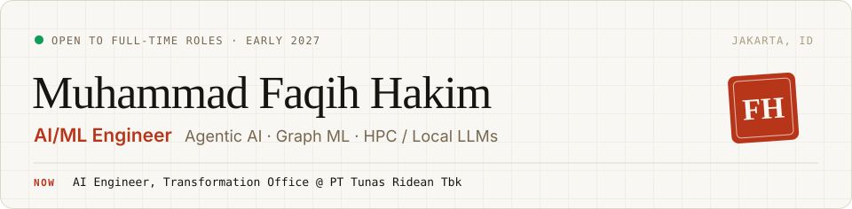
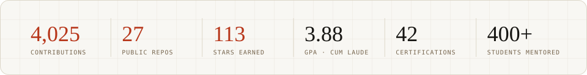
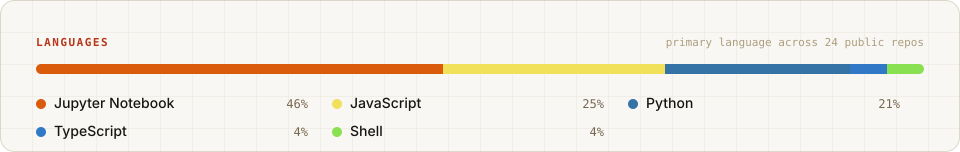

<a href="https://faqihhakim.tech/"><picture><source media="(prefers-color-scheme: dark)" srcset="./svg/header-dark.svg"></picture></a>

I build agentic AI, graph ML, and local LLM systems that move from research into production for enterprise finance, university HPC, and applied research.

**[Portfolio ↗](https://faqihhakim.tech/)** &nbsp;·&nbsp; [Connect](https://connect.faqihhakim.tech/) &nbsp;·&nbsp; [LinkedIn](https://www.linkedin.com/in/faqih-hakim/) &nbsp;·&nbsp; [Hugging Face](https://huggingface.co/faqihhakim) &nbsp;·&nbsp; [contact-me@faqihhakim.tech](mailto:contact-me@faqihhakim.tech)

### Featured work

| Project | What it is | Result |
| --- | --- | --- |
| [**Agentic Fraud Detection**](https://faqihhakim.tech/projects/graph-fraud-detection/) | GNN + LLM-RAG investigator on IBM AML data (thesis) | 25M+ transactions · F1 94.28% · ROC-AUC 0.98 |
| [**DGX Chatbot**](https://faqihhakim.tech/projects/dgx-chatbot-agentic-rag/) | 4-way hybrid RAG on vLLM, NVIDIA DGX A100 | serves 2,000+ students |
| [**Vera**](https://faqihhakim.tech/projects/ai-financial-reconciliation-agent/) | Agentic financial reconciliation for Tunas Group | 97%+ accuracy · 14,000+ docs · 159 branches |
| [**Avo**](https://github.com/Fqih/avo) | Autonomous coding agent and runtime, single binary | sandboxed · 3-tier model failover |

### Stack

```text
ai      Python · PyTorch · Hugging Face · LLM & agentic AI · RAG · scikit-learn
graph   GNN · Neo4j · Memgraph · Qdrant
infra   NVIDIA DGX & HPC · vLLM / local LLMs · Docker · CI/CD · GCP
data    SQL · BigQuery · PostgreSQL · KNIME
web     TypeScript · React · Hono · Tailwind
```

<picture><source media="(prefers-color-scheme: dark)" srcset="./svg/stats-dark.svg"></picture>

<picture><source media="(prefers-color-scheme: dark)" srcset="./svg/langs-dark.svg"></picture>
